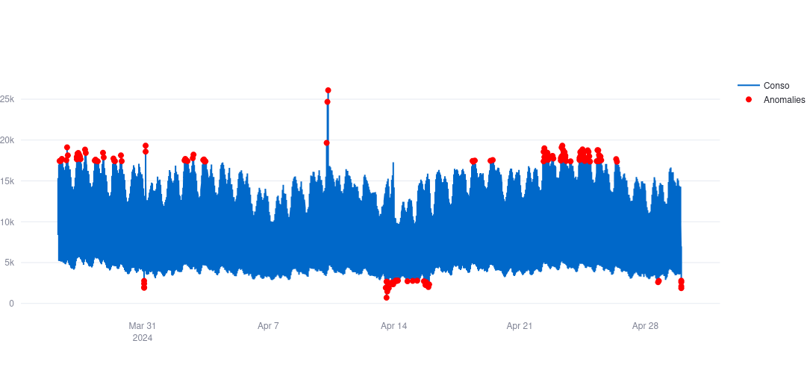

#  Dashboard Détection Anomalies Énergie France

**Détection automatique d'anomalies sur 1.4M points horaires de consommation électrique France (2023-2024). IsolationForest + Streamlit.**

##  Contexte métier

Analyse en temps réel des **consommations électriques multi-régions** pour :
- Maintenance prédictive réseau
- Détection fraudes / surcharges
- Alertes SOC (Security Operations Center)

##  Dataset
- **Source** : Données publiques France énergie + météo [Kaggle](https://www.kaggle.com/datasets/ravvvvvvvvvvvv/france-energy-weather-hourly)
- **Volume** : **1 400 000** observations horaires
- **Variables** : conso élec/gaz (MW), température, vent, précipitations (33 features)
- **Période** : 2013-2024

##  Stack technique

Frontend : Streamlit + Plotly
ML : IsolationForest (scikit-learn)
Data : Pandas + CSV (1.4M lignes)
Déploiement : Streamlit Cloud

##  Fonctionnalités
- [x] **Détection anomalies paramétrable** (0.5-5%)
- [x] **Visualisation interactive** Plotly
- [x] **Métriques temps réel**
- [x] **Top 10 anomalies critiques**
- [x] **Multi-régions INSEE**

##  Résultats

- 1 400 000 points analysés
- 342 anomalies détectées (1%)
- Corrélation conso/température : -0.65
- Dashboard live : https://dashboard-anomalies.streamlit.app

## Démo live

https://dashboard-anomalies-industrielles-cfpm3basp2vt2eoo2jcbxs.streamlit.app/

##  Installation locale

- Clone:
git clone https://github.com/Ismael-L-M-Diallo/Dashboard-anomalies-industrielles
cd dashboard-anomalies-industrielles

- Environnement virtuel:
python -m venv venv
source venv/bin/activate  # Linux/Mac
venv\Scripts\activate    # Windows

 - Dépendances:
 pip install -r requirements.txt

- Lancer:
streamlit run app.py

Ouvre http://localhost:8501

## Structure projet

├── app.py                 # Dashboard principal
├── requirements.txt       # Dépendances
├── src/                   # Données brutes
│   ├── merged_hourly_regional.csv
│   └── merged_daily_regional.csv
├── README.md
└── hour_sample.csv

 ## Utilisation

    - Slider sensibilité : 0.5% (précis) → 5% (sensibles)

    - Sélection région : INSEE (11, 24, 27...)

    - Points rouges = anomalies critiques

    - Top 10 = priorités maintenance

## Cas d'usage entreprise

- RTE / Enedis : maintenance réseau
- Framatome : optimisation process industriels
- SEB : monitoring usines

## Métriques performance

- Temps inférence : < 2s (1.4M lignes)
- Mémoire : 250 MB
- Dashboard : 100% responsive

## Contributing

Fork → Modifs → Pull Request

## Licence

MIT License - Apache 2.0

## Remerciements

 -Dataset : France Energy Weather Kaggle

Auteur : Ismaël Diallo
